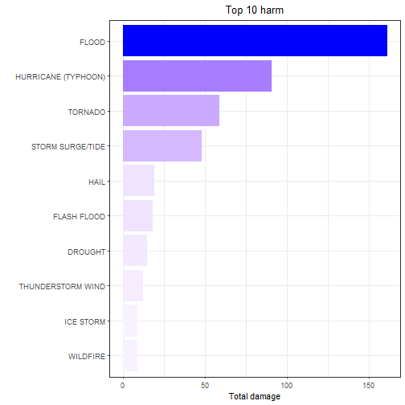

Storm Data across the USA 1950-2011 (Shiny App)
========================================================
author: Robert Ruiter
date: 26 March 2018
autosize: true

Summary
========================================================

This app belongs to a shiny app published on [RStudio](https://rruiter.shinyapps.io/StormData/).
The app is about severe weather events across the USA, ranging from 1950 to 2011.

Cleaning and grouping the data has already been done (for details about this process you can view this on [Severe Weather](https://github.com/r-ruiter/SevereWeather)).  
You can select Year or Eventtype and type of harm. Plotting and corresponding table of results adopt to the changes or  selections you make.

The code for both apps you'll find on GitHub: [Data_Products_assignment_Week4](https://github.com/r-ruiter/Data_Products_Assignment_Week4).

Selecting and presenting data
========================================================


Read the data.

```r
if(!exists("dfStorm")) {
    dfStorm <- readRDS("data/Events.rds")
}
# Assign variables:
vType = c("EVTYPE", "Eventtype")
vCategory = c("TOTALDAMAGE", "Total damage")
```
Select with the variables the top 10. In this case we show which events causes the most total damage (in billions of dollars).

```r
t10 <- top_10(dfStorm, vType[1], vCategory[1])
```
We now have the top 10 which can be shown.

Output
========================================================



***

<!-- html table generated in R 3.4.3 by xtable 1.8-2 package -->
<!-- Mon Mar 26 11:42:38 2018 -->
<table border=1>
<tr> <th>  </th> <th> Eventtype </th> <th> Total damage </th>  </tr>
  <tr> <td align="right"> 1 </td> <td> FLOOD </td> <td align="right"> 161 </td> </tr>
  <tr> <td align="right"> 2 </td> <td> HURRICANE (TYPHOON) </td> <td align="right">  90 </td> </tr>
  <tr> <td align="right"> 3 </td> <td> TORNADO </td> <td align="right">  59 </td> </tr>
  <tr> <td align="right"> 4 </td> <td> STORM SURGE/TIDE </td> <td align="right">  47 </td> </tr>
  <tr> <td align="right"> 5 </td> <td> HAIL </td> <td align="right">  19 </td> </tr>
  <tr> <td align="right"> 6 </td> <td> FLASH FLOOD </td> <td align="right">  18 </td> </tr>
  <tr> <td align="right"> 7 </td> <td> DROUGHT </td> <td align="right">  15 </td> </tr>
  <tr> <td align="right"> 8 </td> <td> THUNDERSTORM WIND </td> <td align="right">  12 </td> </tr>
  <tr> <td align="right"> 9 </td> <td> ICE STORM </td> <td align="right">   8 </td> </tr>
  <tr> <td align="right"> 10 </td> <td> WILDFIRE </td> <td align="right">   8 </td> </tr>
   </table>
